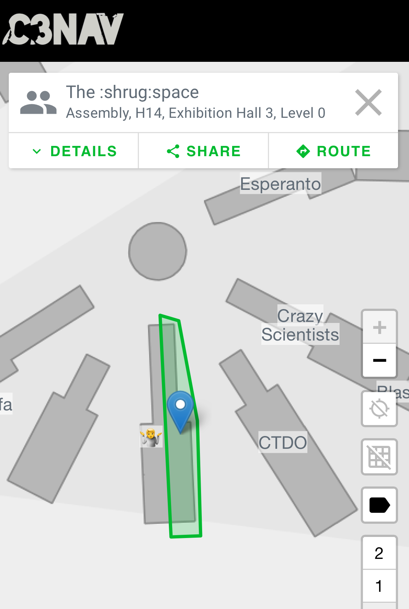

# Toni, the Ginsporter Bot. 
Toni, the Ginsporter Bot. It has gin inside and flees if someone gets close. It a also has Tonic insode, hence the name "Toni".

## About
Tonibot was constructed in advance of 36c3 CCC congress. 

It consists of "hacked" hoverboard, a raspberry, a gametrak controller and a octosonarX2 I2C device with HC-SR04 modules.

## See also:
* https://github.com/NiklasFauth
* https://github.com/Jan--Henrik/hoverboard-breakout
* http://redhunter.com/blog/2017/10/02/octosonarx2/
* https://github.com/ageir/SonarI2C-RPi
* HC-SR04: https://www.electroschematics.com/wp-content/uploads/2013/07/HCSR04-datasheet-version-1.pdf

# Toni's whereabouts: The \:shrug\:space

At the 36c3 congress you can find Toni at the :shrug:space assembly.
We will be happy if you visit us there and get a gin tonic from Toni and talk about it.

